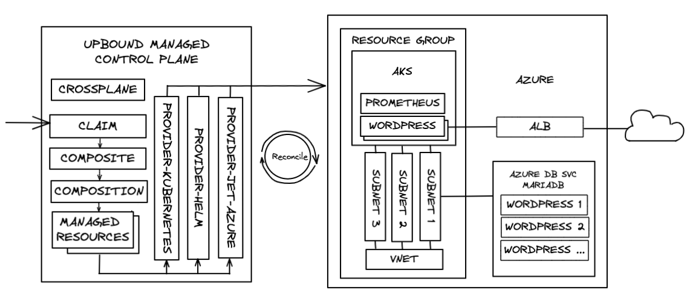

# Azure Reference Platform for Kubernetes + Secure Data Services

This repository contains a reference Azure Platform
[Configuration](https://crossplane.io/docs/v1.6/getting-started/create-configuration.html)
for use as a starting point in [Upbound Cloud](https://upbound.io) or
[Upbound Universal Crossplane (UXP)](https://www.upbound.io/uxp/) to build,
run, and operate your own internal cloud. It provides platform APIs to provision
fully configured Azure AKS clusters, with secure networking and stateful cloud
services (Azure Database for MariaDB) designed to securely connect to the nodes in the AKS cluster, with an application (Wordpress) consuming the infrastructure --
all composed using cloud service primitives from the [Crossplane Jet Azure
Provider](https://doc.crds.dev/github.com/crossplane-contrib/provider-jet-azure). App
deployments can securely connect to the infrastructure they need using secrets
distributed directly to the app namespace.

## Contents

* [Upbound Cloud](#upbound-cloud)
* [Build Your Own Internal Cloud Platform](#build-your-own-internal-cloud-platform)
* [Quick Start](#quick-start)
  * [Create Upbound Cloud Managed UXP Control Plane](#Create-Upbound-Cloud-Managed-UXP-Control-Plane)
  * [Install the Platform Configuration](#Install-the-Platform-Configuration)
  * [Provision Resources](#Provision-Resources)
  * [Cleanup](#Cleanup)
* [Learn More](#learn-more)

## Upbound Cloud


What if you could eliminate infrastructure bottlenecks, security pitfalls, and
deliver apps faster by providing your teams with self-service APIs that
encapsulate your best practices and security policies, so they can quickly
provision the infrastructure they need using a custom cloud console, `kubectl`,
or deployment pipelines and GitOps workflows -- all without writing code?

[Upbound Cloud](https://upbound.io) enables you to do just that, powered by the
open source [Upbound Universal Crossplane](https://www.upbound.io/uxp/) project.

Consistent self-service APIs can be provided across dev, staging, and
production environments, making it easy for app teams to get the infrastructure
they need using vetted infrastructure configurations that meet the standards
of your organization.

## Build Your Own Internal Cloud Platform

App teams can provision the infrastructure they need with a single YAML file
alongside `Deployments` and `Services` using existing tools and workflows
including tools like `kubectl` and gitops platforms to consume your platform's self-service
APIs.

The Platform `Configuration` defines the self-service APIs and
classes-of-service for each API:

* `CompositeResourceDefinitions` (XRDs) define the platform's self-service
   APIs - e.g. `CompositePostgreSQLInstance`.
* `Compositions` offer the composed services supported for each self-service API.

Crossplane `Providers` include the cloud service primitives (AWS, Azure, GCP,
etc.) used in a `Composition`.

Learn more about `Composition` in the [Crossplane
Docs](https://crossplane.io/docs/v1.6/concepts/composition.html).

## Quick Start

At a high-level, this reference platform results in the following architecture.




Three Claims create a Resource Group, Virtual Network with Service Endpoint for Azure Database Service, three Subnets, AKS Cluster attached to the Virtual Network, Azure Database Service with MariaDB engine, Helm install of Prometheus, Helm install of mutlipls Wordpress instances that create dedicated external database instances in the Azure DB instance, and an ALB per Wordpress instance.

The Database Services could be consolidated with the EKS Claim, but it has been kept separate to show modularity in applying Compositions.

In this quick start, you will install Upbound UXP, and use a Crossplane Configuration Package to deploy this configutation in your Azure cloud instance.

### Create Upbound Cloud Managed UXP Control Plane

Managed Control Planes can run on Upbound's cloud infrastructure. They provide a restricted
Kubernetes API endpoint that can be accessed via `kubectl` or continuous deployment systems.

>You will need `kubectl` v1.23.5 (or higher) installed on your local worksation. Consult the Kubenetes docs for directions on installing `kubectl`

#### 1. Create a Free Account in Upbound Cloud:

- Sign up for [Upbound Cloud](https://cloud.upbound.io/register).

- In your browser, create a `Control Plane` in Upbound Cloud. Select `Hosted` and provide name (e.g. dev, staging, prod, etc.).

#### 2. Install the `up` cli:

>`up` is the official CLI for interacting with Upbound Cloud and Universal Crossplane (UXP).
There are multiple ways to [install up cli](https://cloud.upbound.io/docs/cli/#install-script),
including Homebrew and Linux packages.

```console
curl -sL https://cli.upbound.io | sh
up login
```

#### 3. Install the Crossplane kubectl extension (for convenience):

```console
curl -sL https://raw.githubusercontent.com/crossplane/crossplane/master/install.sh | sh
cp kubectl-crossplane /usr/local/bin
```

#### 4. Connect `kubectl` to your `Control Plane` instance:
   * Click on your Control Plane
   * Select the *Connect Using CLI*
   * Paste the commands to configure your local `kubectl` context
   * Test your connectivity by running `kubectl get pods -n upbound-system`

### Install the Platform Configuration

>This will install the Configuration (XRDs, Compositions, and the required Providers). See [Create Your Own Configuration](#Create-Your_Own-Configuration) after this quick start create your own.

#### 1. Set local variables and install Configuration

```console
PLATFORM_VERSION=v0.3.0
PLATFORM_CONFIG=registry.upbound.io/upbound/platform-ref-azure:${PLATFORM_VERSION}

kubectl crossplane install configuration ${PLATFORM_CONFIG}

kubectl get pkg
```

### Create credential data required to configure Provider for Azure:

>In order to manage resources in Azure, you must provide credentials for an Azure service principal that Crossplane can use to authenticate. This assumes that you have already set up the Azure CLI client with your Azure credentials.

#### 1. Create a JSON file that contains all the information needed to connect and authenticate to Azure:

```console
# Create service principal with Owner role
az ad sp create-for-rbac --sdk-auth --role Owner --name platform-ref-azure > crossplane-azure-provider-key.json
```

#### 2. Use the `clientID` value from the JSON file we just created, and save it to an environment variable:

```console
export AZURE_CLIENT_ID=<clientId value from json file>
```

#### 3. Grant required permissions to the service principal that will allow it to manage the necessary resources in Azure:

```console
# add required Azure Active Directory permissions
az ad app permission add --id ${AZURE_CLIENT_ID} --api 00000002-0000-0000-c000-000000000000 --api-permissions 1cda74f2-2616-4834-b122-5cb1b07f8a59=Role 78c8a3c8-a07e-4b9e-af1b-b5ccab50a175=Role

# grant (activate) the permissions
az ad app permission grant --id ${AZURE_CLIENT_ID} --api 00000002-0000-0000-c000-000000000000 --expires never
```

>You might see an error similar to the following, but that is OK, the permissions should have gone through still:
_Operation failed with status: 'Conflict'. Details: 409 Client Error: Conflict for url: https://graph.windows.net/e7985bc4-a3b3-4f37-b9d2-fa256023b1ae/oauth2PermissionGrants?api-version=1.6_

#### 4. Grant admin permissions on the Azure Active Directory to the service principal:

```console
# grant admin consent to the service princinpal you created
az ad app permission admin-consent --id "${AZURE_CLIENT_ID}"
```

>_You might need Global Administrator role to Grant admin consent for Default Directory. Please contact the administrator of your Azure subscription. To check your role, go to Azure Active Directory -> Roles and administrators. You can find your role(s) by clicking on Your Role (Preview)_

After these steps are completed, you should have the following file on your local filesystem:

- crossplane-azure-provider-key.json

### Setup Azure ProviderConfig

>Now we’ll create the Secret that contains the credential data and the ProviderConfig that uses to the secret:

#### 1. Create Secret

```console
kubectl create secret generic azure-account-creds -n upbound-system --from-file=credentials=./crossplane-azure-provider-key.json

rm ./crossplane-azure-provider-key.json
```

#### 2. Create ProviderConfig

```shell
kubectl create -f examples/azure-default-provider.yaml
```

>The output will look like the following:

```shell
provider.azure.crossplane.io/default created
```

>Crossplane resources use the ProviderConfig named `default` if no specific ProviderConfig is specified, so this ProviderConfig will be the default for all Azure resources. Each type of Provider can have a `default` instance in the Crossplane cluster.

### Provision Resources

#### 1. Create AKS Cluster

>The example cluster compposition creates an AKS cluster and includes a nested composite resource for the network, which creates a Resource Group, Virtual Network, and Subnets.

Create the Recource Group, Networking, and AKS cluster:

```console
kubectl apply -f examples/cluster-claim.yaml
```

>_Note: you may see an error similar to this during AKS cluster provisioning: `Error: autorest/azure: Service returned an error. Status=409 Code="RoleAssignmentExists" Message="The role assignment already exists.` This is due to a known issue with the Azure API. The AKS cluster should succesfully provision after Crossplane iterates the reconcile loop a few times._

#### 2. Create an Azure Database Service for MariaDB

```console
kubectl apply -f examples/db-srv-claim.yaml
```

#### 3. Verify the Cluster and Databae become ready (This can take 10-20 minutes):

```console
kubectl get claim
kubectl get composite
kubectl get managed
```
Check your Azure Cloud portal to verify your infrastructure is created.

#### 4. Create applications that consume the above infrastructure

```console
kubectl apply -f examples/wordpress1-claim.yaml

kubectl apply -f examples/wordpress2-claim.yaml
```

#### 5. Verify the Wordpress charts are ready:

```console
kubectl get claim
kubectl get composite
kubectl get managed
```

#### 6. Retrieve the Kubeconfig for yor AKS cluster and  retrieve the Loadbalancer addresses of your Wordpress sites:

```console
kubectl get secret platform-ref-azure-akscluster -o jsonpath='{.data.kubeconfig}' | base64 -d > akskc

kubectl --kubeconfig=akskc get svc -n A
```

Open the public addresses for the two Worpdress LoadBalancer Services in your browser.

###  Cleanup

#### 1. Delete applications

Delete resources created through the `Control Plane` Configurations menu:

```console
kubectl delete -f examples/wordpress1-claim.yaml

kubectl delete -f examples/wordpress2-claim.yaml.yaml
```
Wait until the Wordpress Release resources are completely removed before proceeding.

```console
kubectl get managed
```

#### 2. Delete database server and cluster

Once the two Wordpress Release deletions are are completed, proceed.

```console
kubectl delete -f examples/db-claim.yaml

kubectl delete -f examples/cluster-claim.yaml
```

Verify all underlying resources have been cleanly deleted:

```console
kubectl get managed
```

#### 3. Uninstall Provider & Platform Configuration

```console
kubectl delete configuration.pkg.crossplane.io upbound-platform-ref-azure

kubectl delete provider.pkg.crossplane.io crossplane-provider-azure

kubectl delete provider.pkg.crossplane.io crossplane-provider-helm
```

#### 4. Uninstall Azure App Registration

>_Note: If you plan to continue testing with the Azure provider, perform this cleanup step later_

```console
AZ_APP_ID=$(az ad sp list --display-name platform-ref-azure)

az ad sp delete --id $AZ_APP_ID
```

## Learn More

The Azure cloud service primitives that can be used in a `Composition` today are
listed in the [Crossplane Azure Jet Provider
Docs](https://doc.crds.dev/github.com/crossplane-contrib/provider-jet-azure).

To learn more about creating and publishing your own Configuration Packages, see [Configuration
Packages](https://crossplane.io/docs/v1.7/concepts/packages.html).

### What's Next

If you're interested in building your own reference platform for your company,
we'd love to hear from you and chat. You can setup some time with us at
info@upbound.io.

